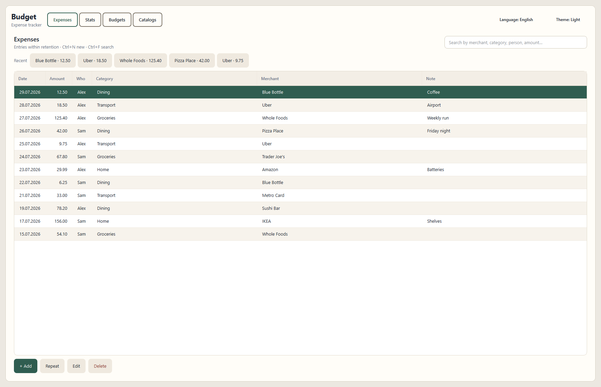
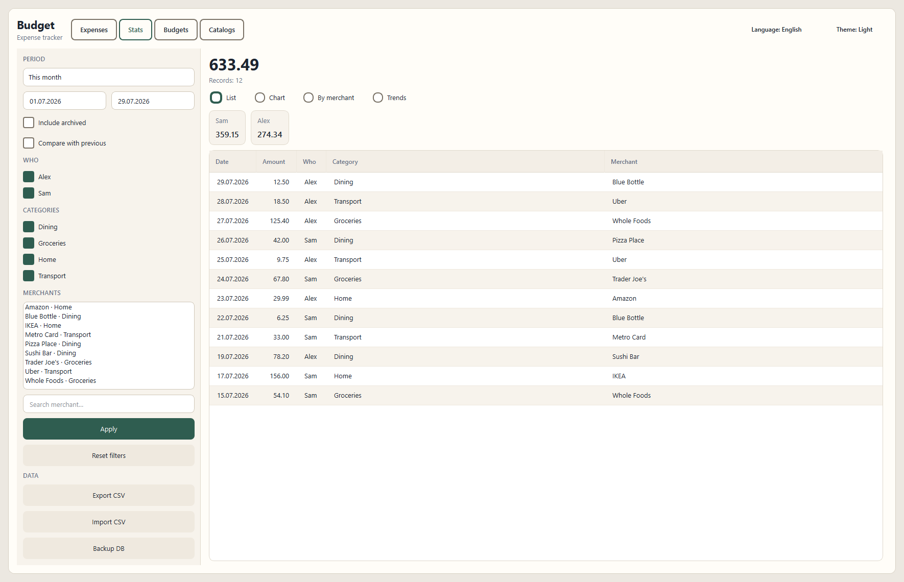
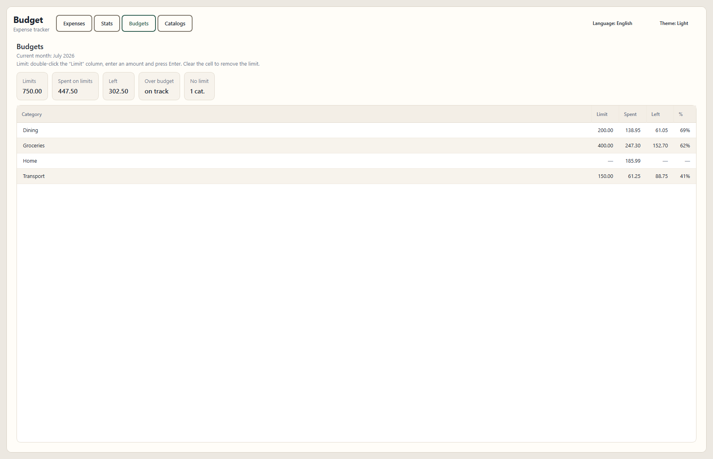

# Budget

Local expense tracker. No cloud, no accounts — just your spending on one computer.

Python 3.12+ · PySide6 · SQLite · v1.0.0 · [MIT](LICENSE)

[Русский](README.ru.md)

---

## Features


|              |                                                           |
| ------------ | --------------------------------------------------------- |
| **Expenses** | Fast entry, repeat, recent templates, search              |
| **Stats**    | Filters, compare with previous period, trends, charts     |
| **Budgets**  | Per-category limits for the current month                 |
| **Catalogs** | People, categories, merchants (merge duplicates, archive) |
| **Data**     | CSV export/import, manual DB backup                       |


There are no seed catalogs — create people, categories, and merchants yourself.

**Language:** on first launch the UI follows the system language (Russian → Russian, otherwise English). You can change it anytime in the header next to the theme control; the choice is saved.

---

## Screenshots

<p align="center">
  
</p>

<p align="center">
  
</p>

<p align="center">
  
</p>

---

## Windows

Download `Budget.exe` from [Releases](https://github.com/KalgovIlya/budget-desktop/releases) and run it.
No installer; data lives in your user profile.


|             | Path                                     |
| ----------- | ---------------------------------------- |
| Database    | `%LOCALAPPDATA%\Budget\budget.db`        |
| Preferences | `%LOCALAPPDATA%\Budget\preferences.json` |
| Backups     | `%LOCALAPPDATA%\Budget\backups\`         |


Build the exe from source (for development):

```powershell
.\scripts\build_windows.ps1
```

Output: `dist\Budget.exe`.

---

## Linux

Run from source or build a single binary with PyInstaller.
Build **on Linux** — Windows→Linux cross-builds are not supported.

### Requirements

- Python **3.12+**
- A graphical session (X11 or Wayland)
- Some distros may need extra system libraries for Qt (often pulled in with PySide6 wheels)

### Run from source

```bash
git clone https://github.com/KalgovIlya/budget-desktop.git
cd budget-desktop

python3 -m venv .venv
source .venv/bin/activate
pip install -r requirements.txt

python -m src.main
```

### Build a binary

```bash
chmod +x scripts/build_linux.sh
./scripts/build_linux.sh
```

Output: `dist/Budget` (one file, no install).

```bash
./dist/Budget
```

Prefer building on a distro no newer than your targets (glibc): a build on Ubuntu 22.04 usually runs on newer systems; the reverse is not always true.


|             | Path                                     |
| ----------- | ---------------------------------------- |
| Database    | `~/.local/share/Budget/budget.db`        |
| Preferences | `~/.local/share/Budget/preferences.json` |
| Backups     | `~/.local/share/Budget/backups/`         |


If `XDG_DATA_HOME` is set, data goes to `$XDG_DATA_HOME/Budget/`.

---

## Keyboard shortcuts


| Keys     | Action                           |
| -------- | -------------------------------- |
| `Ctrl+N` | New expense                      |
| `Ctrl+F` | Focus search on the Expenses tab |
| `Ctrl+S` | Save in the expense dialog       |
| `Esc`    | Close dialog                     |


---

## CSV

One format for export and import:

```text
spent_on;amount_rub;person;category;merchant;note
```

**Import fully replaces** current catalogs and expenses with the file contents (with confirmation).
There is no auto-backup — use “Backup DB” in Stats before importing if needed.

---

## Development

```bash
# tests
pytest

# Windows (dev)
python -m venv .venv
.\.venv\Scripts\Activate.ps1
pip install -r requirements.txt
python -m src.main
```

