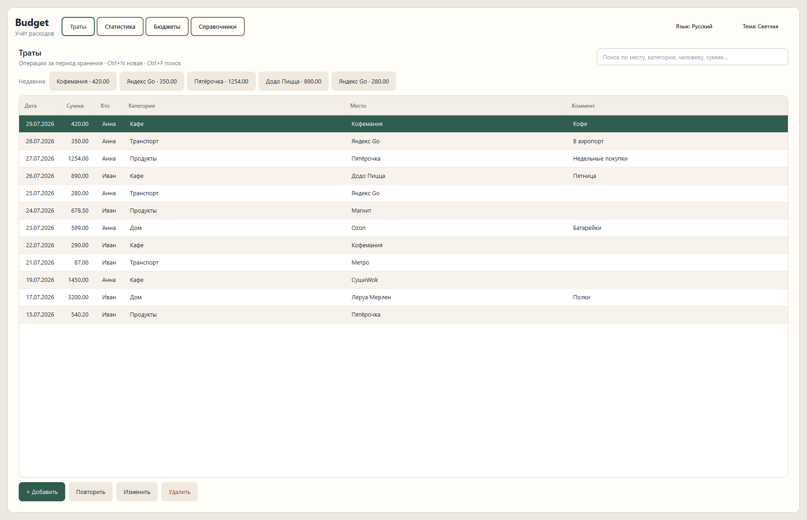
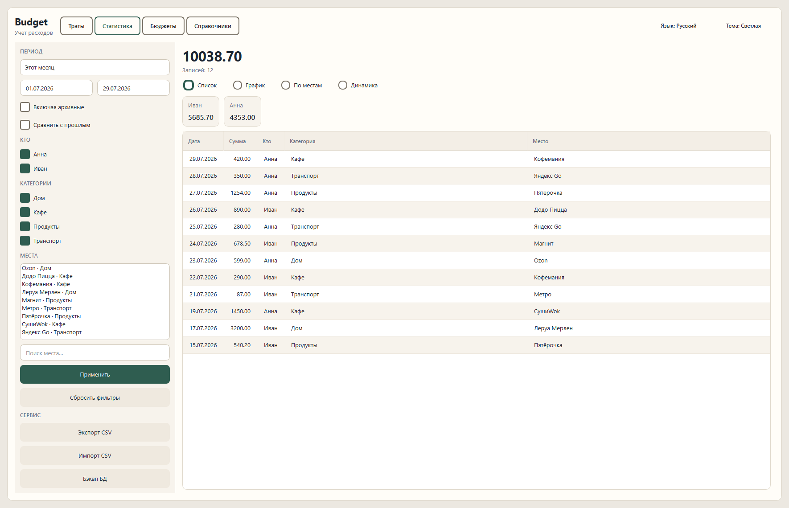
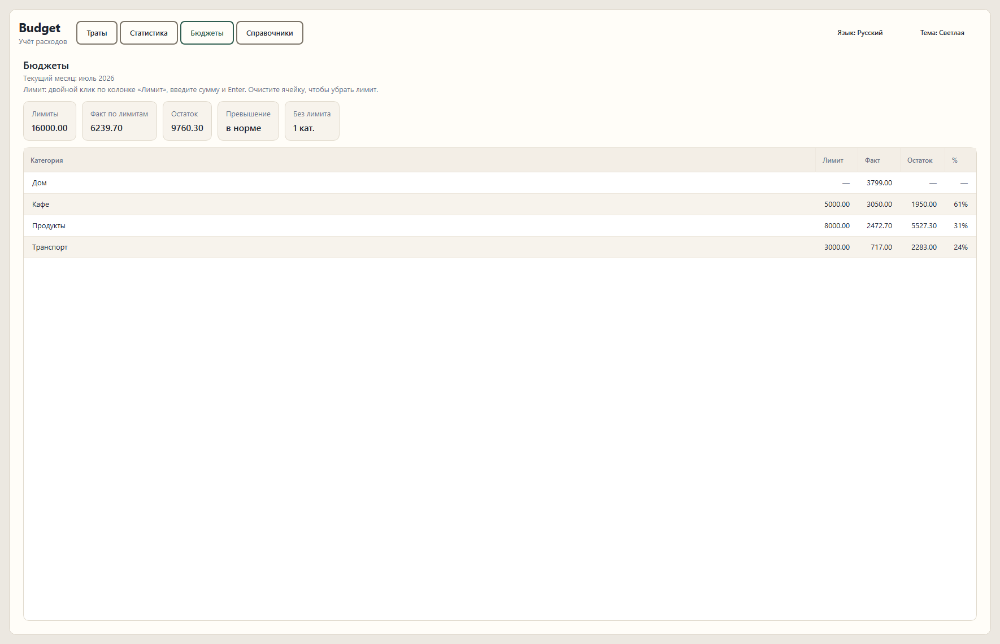

# Budget

Локальный учёт расходов.
Без облака, без аккаунтов, без «кто кому должен» — только ваши траты на одном компьютере.

Python 3.12+ · PySide6 · SQLite · v1.0.0 · [MIT](LICENSE)

[English](README.md)

---

## Возможности

| | |
|---|---|
| **Траты** | Быстрый ввод, повтор, недавние шаблоны, поиск |
| **Статистика** | Фильтры, сравнение с прошлым периодом, динамика, графики |
| **Бюджеты** | Лимиты по категориям на текущий месяц |
| **Справочники** | Люди, категории, места (объединение дублей, архив) |
| **Данные** | Экспорт/импорт CSV, ручной бэкап БД |

Стартовых справочников нет — людей, категории и места создаёте сами.

**Язык:** при первом запуске UI берётся из системного языка (русский → русский, иначе английский). Переключается в шапке рядом с темой; выбор сохраняется.

---

## Скриншоты

<p align="center">
  
</p>

<p align="center">
  
</p>

<p align="center">
  
</p>

---

## Windows

Готовый релиз: скачайте `Budget.exe` из [Releases](https://github.com/KalgovIlya/budget-desktop/releases) и запустите.
Установка не нужна; данные хранятся в профиле пользователя.

| | Путь |
|---|---|
| База | `%LOCALAPPDATA%\Budget\budget.db` |
| Настройки | `%LOCALAPPDATA%\Budget\preferences.json` |
| Бэкапы | `%LOCALAPPDATA%\Budget\backups\` |

Сборка exe из исходников (для разработки):

```powershell
.\scripts\build_windows.ps1
```

Результат: `dist\Budget.exe`.

---

## Linux

Можно запускать из исходников или собрать один бинарь (PyInstaller).
Сборку нужно делать **на Linux** — кросс-сборка Windows→Linux не поддерживается.

### Требования

- Python **3.12+**
- Графическая сессия (X11 или Wayland)
- На некоторых дистрибутивах для Qt нужны системные библиотеки (обычно подтягиваются с колёсами PySide6)

### Запуск из исходников

```bash
git clone https://github.com/KalgovIlya/budget-desktop.git
cd budget-desktop

python3 -m venv .venv
source .venv/bin/activate
pip install -r requirements.txt

python -m src.main
```

### Сборка бинаря

```bash
chmod +x scripts/build_linux.sh
./scripts/build_linux.sh
```

Результат: `dist/Budget` (один файл, без установки).

```bash
./dist/Budget
```

Бинарь лучше собирать на дистрибутиве не новее целевого (glibc): сборка на Ubuntu 22.04 обычно запускается и на более новых системах; наоборот — не всегда.

| | Путь |
|---|---|
| База | `~/.local/share/Budget/budget.db` |
| Настройки | `~/.local/share/Budget/preferences.json` |
| Бэкапы | `~/.local/share/Budget/backups/` |

Если задан `XDG_DATA_HOME`, данные окажутся в `$XDG_DATA_HOME/Budget/`.

---

## Горячие клавиши

| Клавиши | Действие |
|---------|----------|
| `Ctrl+N` | Новая трата |
| `Ctrl+F` | Поиск на вкладке «Траты» |
| `Ctrl+S` | Сохранить в диалоге траты |
| `Esc` | Закрыть диалог |

---

## CSV

Один формат для экспорта и импорта:

```text
spent_on;amount_rub;person;category;merchant;note
```

**Импорт полностью заменяет** текущие справочники и траты содержимым файла (с подтверждением).
Автобэкапа нет — перед импортом при необходимости сделайте «Бэкап БД» в статистике.

---

## Разработка

```bash
# тесты
pytest

# Windows (dev)
python -m venv .venv
.\.venv\Scripts\Activate.ps1
pip install -r requirements.txt
python -m src.main
```
